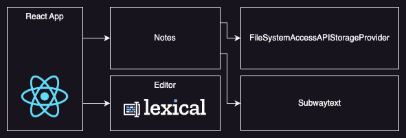

# Contributing

Contributions are always welcome, no matter how large or small! Before
contributing, please read the [code of conduct](./CODE_OF_CONDUCT.md).

## Concepts

If you want to contribute, here are some links that offer some basic
insights on how NENO works:

* [README](./README.md)
* [Subtext Graph Specification](https://polyrainbow.github.io/neno/docs/subtext-graph-specification.html)
* [User Manual](https://polyrainbow.github.io/neno/docs/index.html)

## Development setup

Make sure you have Node.js v22 or newer installed. Clone this repo and run
`npm i`. To start a development instance, run `npm run dev`.

## Publishing a release

1. Run `npm run version:{major,minor,patch}`
2. Push commit to remote
3. Push tag to remote: `git push origin vX.Y.Z`

The release package will now be built remotely with the script 
`tools/buildReleasePackage.sh`

## High-level architecture

### Core application
- Technology: React
- Entry point: `/src/main.tsx`

### Editor
- Technology: [Lexical](https://lexical.dev)
- Entry point: `/src/lib/editor`

### Notes
- Entry point: `/src/lib/notes`

NENO highly depends on the heart of the application, the "Notes" module.
It contains all the core logic to create/read/update/delete notes and files.
It manages the note graph, including indexes.

### FileSystemAccessAPIStorageProvider
- Entry point: `/src/lib/FileSystemAccessAPIStorageProvider.tsx`

A class that provides methods to manage a
[FileSystemDirectoryHandle](https://developer.mozilla.org/en-US/docs/Web/API/FileSystemDirectoryHandle). The class is initialized with such a handle.
The "Notes" module uses an instance of this class to read and update the graph
that is saved in the file system of the user's device.

### Subwaytext parser
- Entry point: `/src/lib/subwaytext`

NENO's Subtext parser parses a Subtext string to an array of blocks.
It can also serialize blocks to a Subtext string. The "Notes" module depends
on it.

## Commit convention
See https://www.conventionalcommits.org/en/v1.0.0/

## Deploying NENO on your own server

To deploy NENO, you need a web space capable of serving static files via HTTPS.

### 1. Clone this repository

### 2. Install dependencies
Run `npm i`

### 3. Build the app from the source

Set the `base` property in the Vite config to the correct basepath of your
hosting environment and run `npm run build`.

### 4. Copy files to webspace

Copy the all files from the `dist` directory your filespace.

Make sure that your webspace contains a SPA fallback mechanism so that requests
to non-existing files are forwarded to `index.html`.