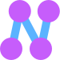

  

# NENO 

## What is NENO?

NENO is a powerful note-taking app that helps you manage your personal knowledge garden. With NENO, your data belongs to you and you decide where it is stored: On your device or on a cloud storage of your choice.

## Screenshots

*NENO Editor view in light mode*

*NENO Editor view in dark mode*

## Features

* Full data ownership: You decide where your data is stored: On your device or on a cloud storage of your choice.
* Multiple media types: Paste video, audio, PDF documents, images and code, or any arbitrary file into your note
* Graph View: Drag and drop nodes and create your custom knowledge graph visualization
* Simple modeless markup with [Subtext](https://github.com/subconsciousnetwork/subtext/)
* Interoperability: NENO's data format is backed by human-readable plain-text files for high interoperability
* Powerful full-text search
* Tap-to-link: One click is enough to link one note to another
* File overview: All files in one view
* Dark mode: Eye-friendly note-taking at night time

## Getting started

Read the [user manual](./docs/index.md) or just [go to the app](https://sebastianzimmer.github.io/neno). Please note that your browser
must support File System Access (Chrome, Edge, ...).

## Further reading

* [User manual](./docs/index.md)
* [Why I built NENO](./docs/posts/Serendipity.md)
* [Contributing](./CONTRIBUTING.md)
