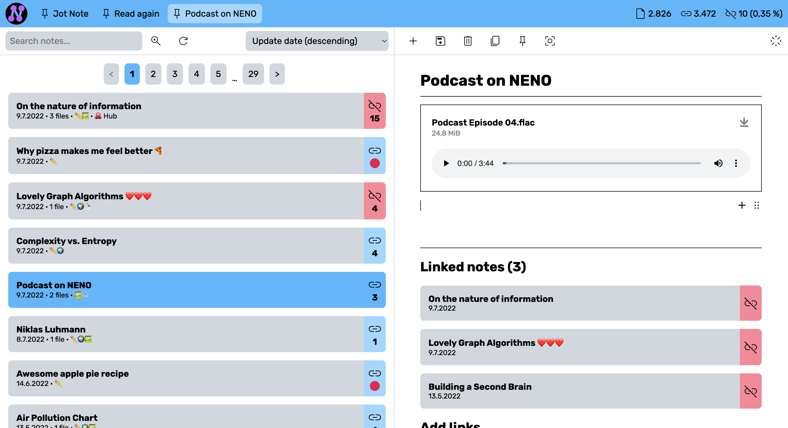
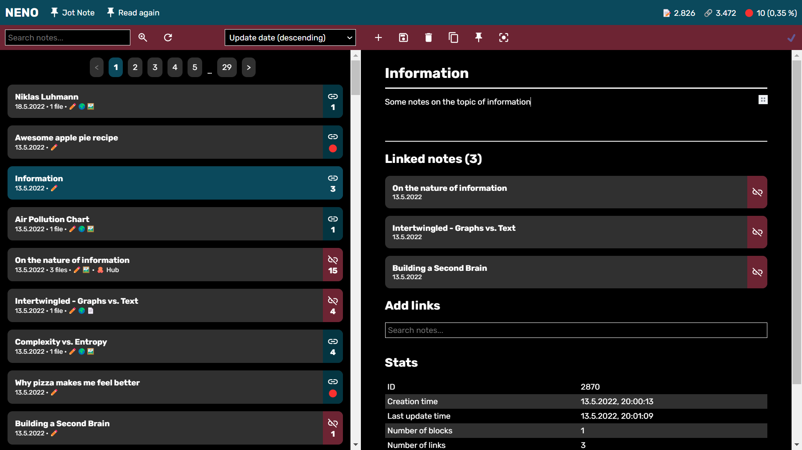

# NENO

NENO is a note-taking app that helps you creating your personal knowledge graph. With NENO, you retain full control over your data because you decide where it is stored: On your local machine, on a cloud storage of your choice, or even on a server under your control.

## Features

* Full data ownership: You decide where your data is stored: On your local machine, on a cloud storage of your choice, or even on a server under your control.
* WYSIWYG editor that allows to paste multiple media types: video, audio, PDF documents, images and code
* Graph View: Drag and drop nodes and create your custom knowledge graph visualization
* Powerful full-text search
* Tap-to-link: One click is enough to link two notes
* File overview: All uploaded files in one view
* Lossless export: Export your data lossleslly to create backups or to move it to another NENO instance
* Dark mode: Eye-friendly note-taking at night time

## Getting started

There are two modes in which NENO can operate: **Server mode** and
**local mode**.

### Server mode

Server mode requires you to set up your own server.
Server mode has the advantage that you can access your data from everywhere you
want. In addition, in server mode NENO will retrieve metadata on pasted URLs
and displays them with your note.
The NENO server supports
* HTTPS and SSL certificates for secure connections
* as many users and graphs as you like
* two-factor authentication with password and token

[How to setup a NENO server](./docs/Server.md)

### Local mode

In local mode, NENO stores the data in a directory of your choice on your
local machine (could be a cloud storage folder for example).
In local mode, no note data is sent to the web server.
To run NENO in local mode, you do not need a Node.js server. You only need a
web space capable of serving static files via HTTPS.

[Deploying NENO for local mode usage](./docs/DeployNENOLocalMode.md)

## Further reading

* [Why I built NENO](https://webaudiotech.com/2021/02/13/serendipity-and-the-most-detailed-map-of-my-knowledge-that-ever-existed/)

* [How to use the Graph view](./docs/GraphViewManual.md)

* [Tips and tricks for working with NENO](./docs/TipsAndTricks.md)

* [Developer Notes](./docs/DeveloperNotes.md)
