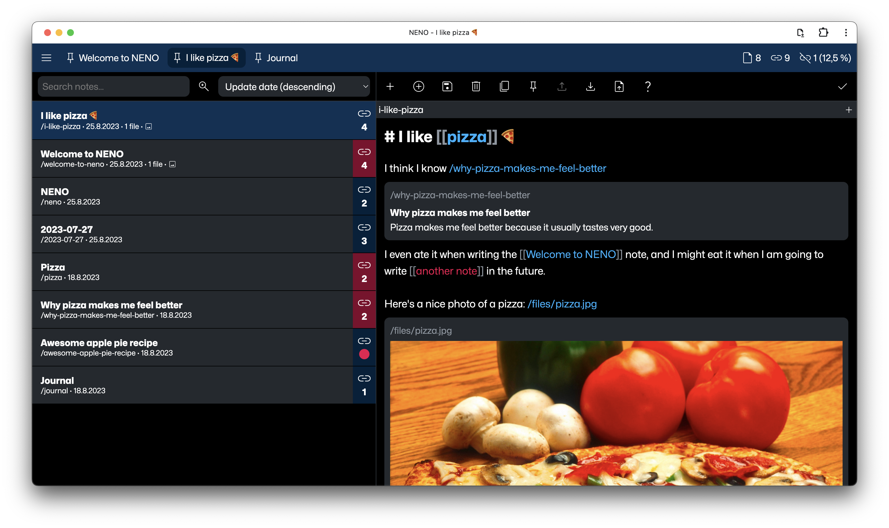
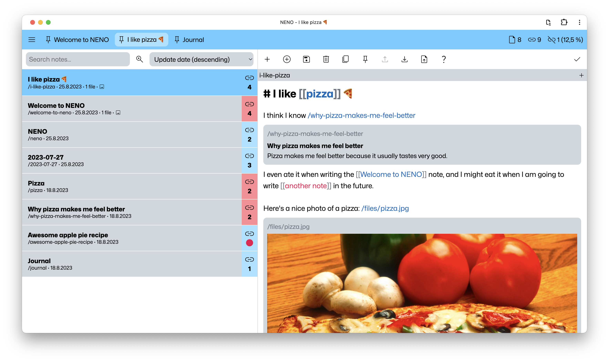

  

# NENO 

## What is NENO?

NENO is a powerful note-taking app that helps you manage your personal knowledge garden. With NENO, your data belongs to you and you decide where it is stored: On your device or on a cloud storage of your choice.

## Screenshots

*NENO Editor view in dark mode*

*NENO Editor view in light mode*

## Features

* Full data ownership: You decide where your data is stored: On your device or on a cloud storage of your choice.
* File imports and previews: Paste video, audio, PDF documents, images and code, or any arbitrary file into your note. NENO will show a preview or player where possible.
* Simple modeless markup with [Subtext](https://github.com/polyrainbow/subtext/)
* Programmable notes: Embed `run` blocks of JavaScript directly in any
  note to query, transform, or aggregate your graph; share helpers
  between notes via reusable `mod` modules
* Versioning: NENO automatically manages a Git repository of your notes, so you
can go back to any point in time
* Interoperability: NENO works with human-readable plain-text files and implemenents the free and open [Subtext Graph Specification](https://polyrainbow.github.io/neno/docs/subtext-graph-specification.html)
* Powerful full-text search
* Tap-to-link: One click is enough to link one note to another

## Getting started

Read the [user manual](https://polyrainbow.github.io/neno/docs/index.html) or just [go to the app](https://polyrainbow.github.io/neno). Please note that your browser
must support File System Access (e.g. Chrome, Edge).

## Further reading

* [User manual](https://polyrainbow.github.io/neno/docs/index.html)
* [Subtext Graph Specification](https://polyrainbow.github.io/neno/docs/subtext-graph-specification.html)
* [Contributing](./CONTRIBUTING.md)
