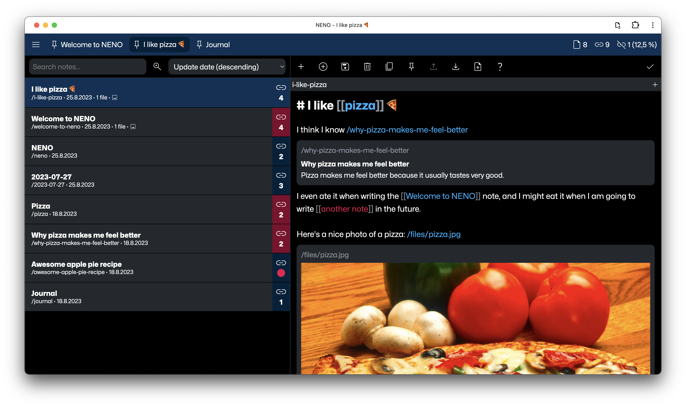
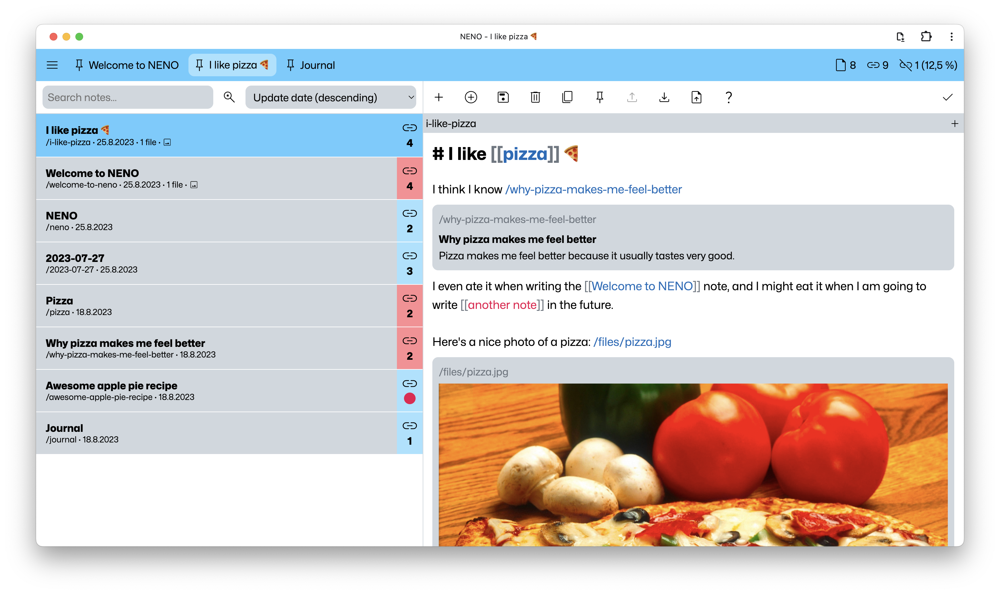

<p align="center">
  
</p>

# NENO 

## What is NENO?

NENO is a powerful note-taking app that helps you manage your personal knowledge garden. With NENO, your data belongs to you and you decide where it is stored: NENO is a macOS desktop app that keeps your notes as plain-text files in a folder you choose — on your device, or in a synced folder of your choice.

## Screenshots


*NENO Editor view in dark mode*


*NENO Editor view in light mode*

## Features

* Full data ownership: You pick the folder, NENO writes plain `.subtext` files into it — no database, no lock-in.
* File imports and previews: Paste video, audio, PDF documents, images and code, or any arbitrary file into your note. NENO will show a preview or player where possible.
* Simple modeless markup with [Subtext](https://github.com/polyrainbow/subtext/)
* Programmable notes: Embed `run` blocks of JavaScript directly in any
  note to query, transform, or aggregate your graph; share helpers
  between notes via reusable `mod` modules
* Versioning: NENO automatically manages a Git repository of your notes, so you
can go back to any point in time
* Interoperability: NENO works with human-readable plain-text files and implemenents the free and open [Subtext Graph Specification](https://polyrainbow.github.io/neno/docs/subtext-graph-specification.html)
* Powerful full-text search
* Tap-to-link: One click is enough to link one note to another

## Getting started

Download the latest `NENO-<version>.dmg` from the
[releases page](https://github.com/polyrainbow/neno/releases), open it and
drag NENO to your Applications folder. Then read the
[user manual](https://polyrainbow.github.io/neno/docs/index.html).

NENO requires **macOS on Apple Silicon** — the release is an arm64 build,
so it will not run on an Intel Mac. Applications is only a convention: if
you have no admin rights on the machine, keep the app anywhere you like,
such as `~/Desktop`, and adjust the paths below to match.

The build is **not code-signed**, so the first launch needs a detour around
Gatekeeper: right-click (or Control-click) the app in Finder and choose
**Open**, then confirm.

If macOS instead claims the app "is damaged and can't be opened", the
download picked up a quarantine attribute. Right-click → Open does not get
past that one — clear the attribute instead:

```sh
xattr -dr com.apple.quarantine /Applications/NENO.app
```

No `sudo` and no admin rights are needed: the app is yours, wherever you
put it. Every launch after the first one works normally.

## Further reading

* [User manual](https://polyrainbow.github.io/neno/docs/index.html)
* [Subtext Graph Specification](https://polyrainbow.github.io/neno/docs/subtext-graph-specification.html)
* [Contributing](./CONTRIBUTING.md)

## Licensing

NENO is licensed under the [Apache License 2.0](./LICENSE).

The bundled fonts — IBM Plex Mono (© 2017 IBM Corp.) and Mona Sans
(© 2022 The Mona Sans Project Authors) — are third-party Font Software
licensed under the SIL Open Font License 1.1, not under Apache-2.0. See
[`NOTICE.md`](./NOTICE.md) for the full third-party notices.
