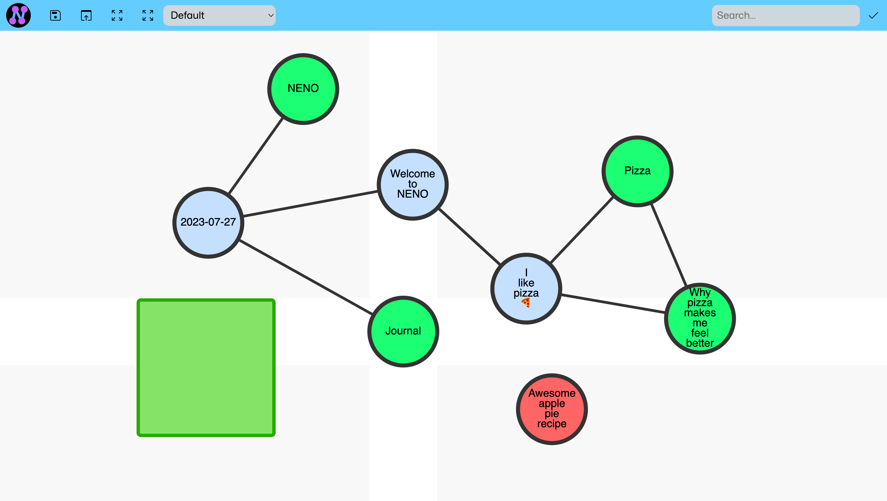
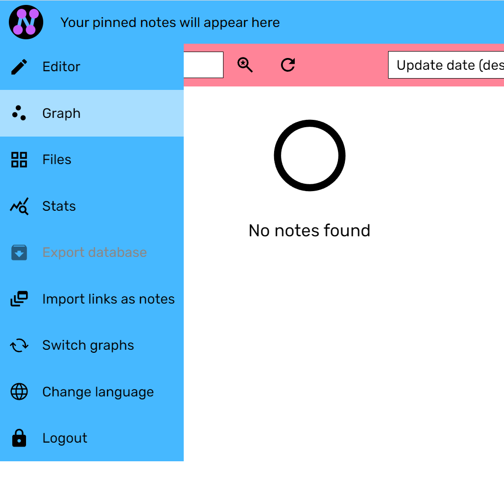

# Graph view

One of NENO's best features is the Graph View. In the Graph View, your notes are shown as a network graph in which notes are
displayed as graph nodes and links between notes are displayed as graph edges.
You can zoom in and out with the mouse wheel, move notes and add/remove links.

## Accessing the Graph view

Click on the NENO logo in the top left corner to open the application menu.
In there and click on "Graph".

Please note, that you have to save your changes after making your modifications.

## 🟩 The INPI (Initial Node Position Indicator)

New notes will appear at the INPI (Initial Node Position Indicator). It is the green square. You can move the nodes from there to another position. You can also drag and drop the INPI itself to another position.

## Node background colors and what they mean
* ⚪ White (or default node color): Normal nodes
* 🟢 Green: New nodes that have been created within the last few days
* 🔵 Blue: Hubs (nodes with more than 4 links)
* 🔴 Red: Nodes with no links

## Move a node
Just drag a node and drop it where you want it to be.

## Selecting nodes
Press and hold the `S` key and click on the nodes you
want to select. If you want to unselect a node, press and hold `S` and click on the selected node again.

To select all linked nodes to the nodes of the current selection, press `L`.
If you press `L` often enough, you will eventually have the whole
components of the initially selected nodes selected.

Press `Esc` to unselect all nodes and edges.

## Move several nodes at once
To move several nodes at once, first select the nodes which you want to
move. Then drag one of the selected nodes and drop it where
you want it to be. All selected nodes will follow the drag.
Please note that the node you drag is always included in the movement,
regardless of whether it is selected or not.

## Inflating the graph

When you have a graph with a lot of nodes but do not have enough real estate to put more notes in between, you can inflate the graph by 10% by clicking on the button in the title bar. You can do the same for the current selection.

Don't use this function too often for it will quickly result in a graph which
is not well overseeable anymore. Use it only if absolutely necessary.

## User interface performance

When you have a lot of notes in your graph (> 1000), dragging the graph and zooming in and out may become laggy. If that is the case, you can disable rendering the note titles by clicking  the `Toggle text rendering` button in the title bar. If your graph has at least 500 nodes, text rendering is disabled by default and must be enabled manually by clicking the button.

When text rendering is disabled, note titles are still be displayed in the bottom-left corner when hovering over a node.
