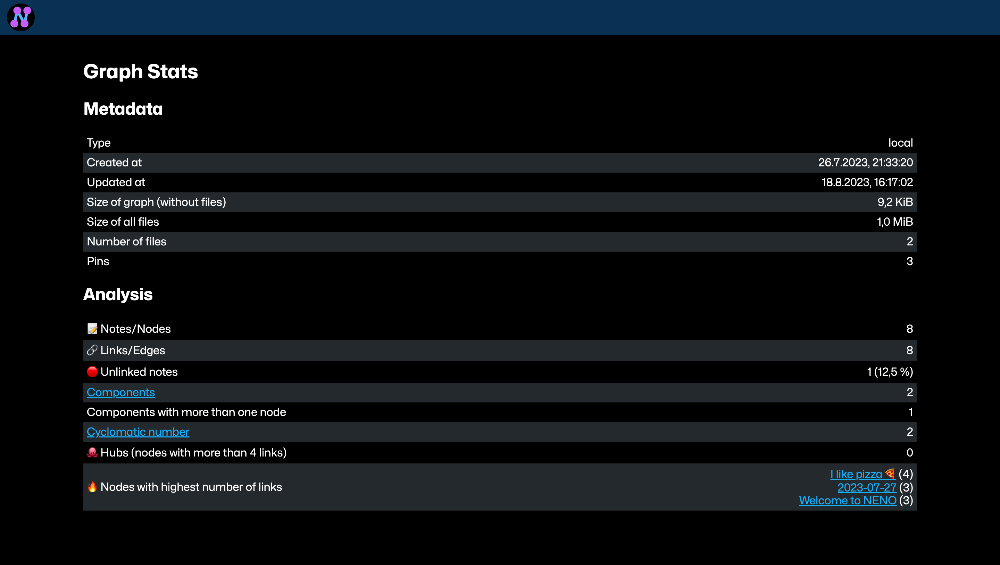

# Tips And Tricks for working with NENO

## Search box
By default, the input of the search box is tokenized and notes are shown
whose title contains every token. By entering a prefix followed by a `:` before
the actual search string, you can change that behavior.

### `exact:` - Search for exact titles
In editor view, the notes list can be filtered with the search box. By default, the search input is splitted into tokens (words or part of words) and then all notes are displayed that contain all of those tokens.

When you have a lot of nodes with a similar name, this may not be that helpful.

In that case, you can type `exact:` followed by the exact title of the note in the search box. In that case, only notes whose title are an exact match are displayed.

### `duplicates:` - Search for duplicates

With the prefix duplicates, duplicate notes can be found.

#### `duplicates:url` - Show notes with same URLs

When you have a lot of notes, chances are that the same URL is included in several notes. To find such notes, use the `Show notes with same URLs` button in the note list control bar, or type  `duplicates:url` into the search box.

#### `duplicates:title` - Show notes with same titles

Find notes that have the same title.

### `ft:` - Full-text search
You can perform a full-text search on all notes by typing `ft:` followed by the search query
into the search box. The full-text search is case-insensitive.

### `has:` - Search for notes that posess a specific block type

For example `has:audio`. The following block types are supported:

* paragraph
* heading
* audio
* image
* video
* document
* link
* code
* list

### `has-url:` - Search for notes that contain a specific url

For example `has-url:https://google.com`

### Search presets

You can save every search query as a preset by opening the `Search presets` view by clicking the button next to the search input field. 
You can also quickly query saved presets.

## Stats and number of components

It might be interesting to you to see some stats on your graph or see how many [components](https://en.wikipedia.org/wiki/Component_(graph_theory)) it has. Use the `Stats` view for this, which you can find in the app menu.

## Graph View

See [How to use the Graph view](./GraphView.md)