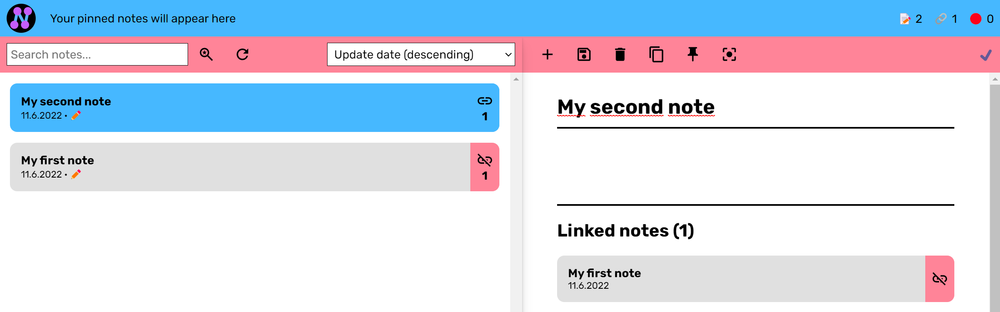

  

# NENO User Manual

Hello there and welcome to the NENO user manual. 👋 Cool to see that you are interested in NENO. We hope that this manual provides you with all you need to become a NENO super user.

## What is NENO?

NENO is a powerful note-taking app that helps you create your personal knowledge graph. If you do not know what a personal knowledge graph is, read [this great introduction by Dan McCreary](https://towardsdatascience.com/personal-knowledge-graphs-9a23a0b099af). With NENO, you retain full control over your data because you decide where it is stored: On your device, on a cloud storage of your choice, or even on a server under your control.

NENO is open-source software which means it is completely free to use.

### Some features

* Full data ownership: You decide where your data is stored: On your device, on a cloud storage of your choice, or even on your own NENO server.
* WYSIWYG editor that allows to paste multiple media types: video, audio, PDF documents, images and code
* Graph View: Drag and drop nodes and create your custom knowledge graph visualization
* Powerful full-text search
* Tap-to-link: One click is enough to link two notes
* File overview: All uploaded files in one view
* Lossless export: Export your data losslessly to create backups or to migrate to another NENO instance
* Dark mode: Eye-friendly note-taking at night time

## Getting started

There are two fundamental ways how NENO can be used: **Local mode** and **server mode**.

### Local mode

In local mode, NENO stores the data in a folder of your choice on your
device. If you want, you could also select a cloud storage folder so that your notes are synchronized to all your devices.
In local mode, no note data is sent to the web server.

To use NENO in local mode, you do not need technical knowledge, just go to this link to start:
[NENO App](https://sebastianzimmer.github.io/neno/login)

### Server mode

Server mode requires you to set up your own server.
You should have some technical knowledge to do that.
Server mode has the advantage that you can access your data from everywhere you
want. In addition, in server mode NENO will retrieve metadata on pasted URLs
and displays them with your note.
NENO server supports
* HTTPS and SSL certificates for secure connections
* as many users and graphs as you like
* two-factor authentication with password and token

Read this guide if you want to set up your own NENO server:

[How to setup a NENO server](./Server.md)

#### Deploy your own NENO instance for local mode

You can also deploy and run a NENO instance for local mode.
For this, you do not need a Node.js server. You only need a
web space capable of serving static files via HTTPS.

[Deploying NENO for local mode usage](./DeployNENOLocalMode.md)

## Taking notes

Taking notes in NENO is quite straight-forward. Just start writing your note
in the editor and save it. You will see that the note list on the left now
contains your first note:

If you create another one, you can link it with the first one by clicking on the
chain icon of your first note in the note list:

After you have saved your second note, you will see that these two notes are
now linked:

You can see that in the Graph view as well:

## Graph View

One of the best features of NENO is the Graph view.
[Read here how to use the Graph view](./GraphView.md)

## Tips and Tricks

Now you should already be familiar with NENO's basic functionality. But there
are some [tips and tricks for working with NENO](./TipsAndTricks.md) that
can make your life easier.