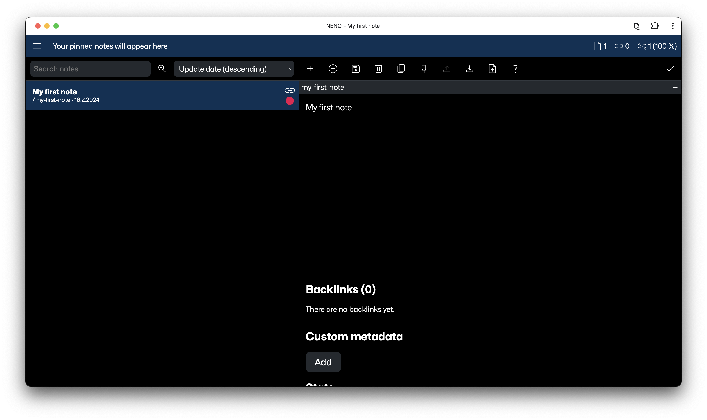

  

# NENO User Manual

Hello there and welcome to the NENO user manual. 👋 Cool to see that you are interested in NENO. We hope that this manual provides you with all you need to become a NENO super user.

## What is NENO?

NENO is a powerful note-taking app that helps you create your personal knowledge graph. If you do not know what a personal knowledge graph is, read [this great introduction by Dan McCreary](https://towardsdatascience.com/personal-knowledge-graphs-9a23a0b099af). With NENO, you retain full control over your data because you decide where it is stored: On your device, on a cloud storage of your choice, or even on a server under your control.

NENO is open-source software which means it is completely free to use.

### Some features

* Full data ownership: You decide where your data is stored: On your device or on a cloud storage of your choice.
* Multiple media types: Paste video, audio, PDF documents, images and code into your note
* Graph View: Drag and drop nodes and create your custom knowledge graph visualization
* Simple plaintext editor
* Powerful full-text search
* Tap-to-link: One click is enough to link two notes
* File overview: All uploaded files in one view
* Lossless export: Export your data losslessly to create backups or to migrate to another NENO instance
* Dark mode: Eye-friendly note-taking at night time

## Getting started

NENO stores the data in a folder of your choice on your
device. If you want, you could also select a cloud storage folder so that your notes are synchronized to all your devices. You could also use a Git repository to manage your notes. That way, you also get versioning for free.
**The app does not send any user data to a web server**. 

To use NENO in local mode, you do not need technical knowledge, just go to this link to start:
[NENO App](https://sebastianzimmer.github.io/neno)

Beware that yor web browser has to support a feature called
"File System Access API". At the time of writing, the desktop versions
of Chrome, Edge, Opera, and Safari do support it.
Mobile browser versions are not supported yet.
We recommend to use a Chromium-based browser (Chrome, Opera, Edge, etc.).

## Taking notes

Taking notes in NENO is quite straight-forward. Just start writing your note
in the editor and save it. You will see that the note list on the left now
contains your first note:

Notes are written in the [Subtext](https://github.com/subconsciousnetwork/subtext).
The editor features transclusions to other notes and files of your note corpus.

When you create another note, you can link it with the first one by clicking on the
chain icon of your first note in the note list:

This will add a Wikilink to your note content. After you have saved your second note, you will see that these two notes are
now linked:

You can see that in the Graph view as well:

## Graph View

One of the best features of NENO is the Graph view.
[Read here how to use the Graph view](./GraphView.md)

## Tips and Tricks

Now you should already be familiar with NENO's basic functionality. But there
are some [tips and tricks for working with NENO](./TipsAndTricks.md) that
can make your life easier.

## Keyboard Shortcuts

### Editor

- Save note: `CTRL`/`CMD` + `s`
- Toggle edit mode/viewer mode: `CTRL`/`CMD` + `.`