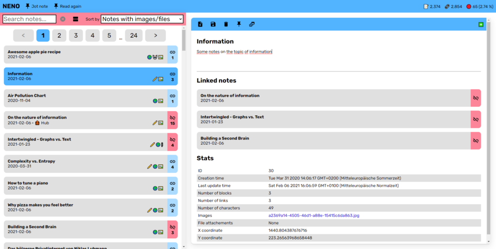
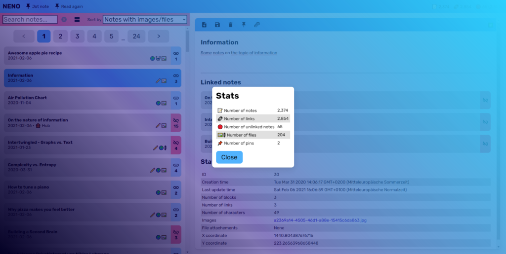
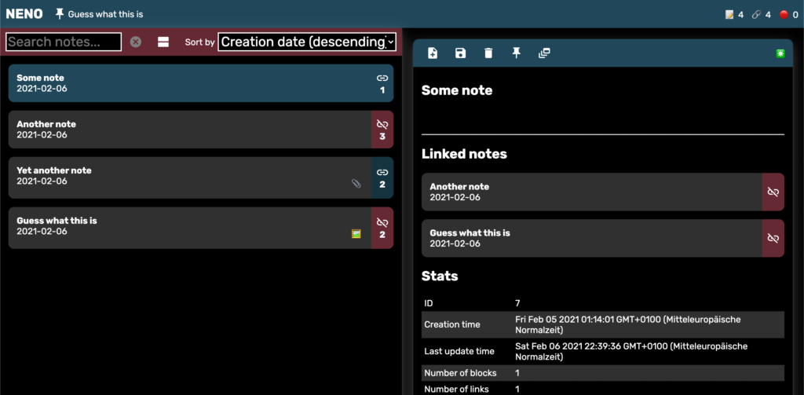
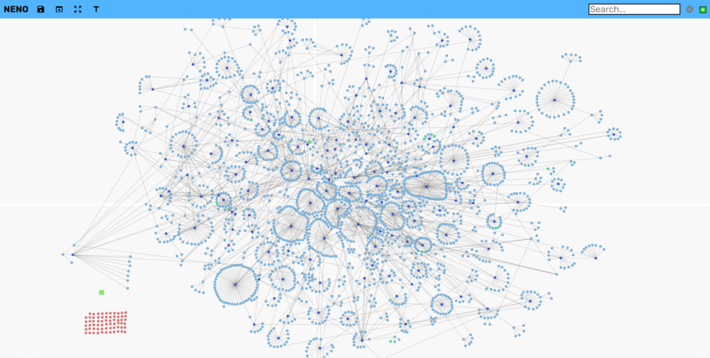

# Serendipity and the most detailed map of my knowledge that ever existed

*This text was first published on 2021/02/13 in the personal blog of the creator of NENO. Some links have been updated.*

## Introduction / TL;DR

Existing note-taking apps like OneNote or Evernote are unsatisfying to me, especially when it comes to ordering and structuring your notes and keeping control over your data. This is why I have built an app called NENO (an acronym for “network of notes”) that not only lets you take notes, but also helps you to create your personal knowledge graph by letting you link individual notes and define the topology of the resulting graph, i. e. you can freely position the nodes on a 2D plane. With this, you are able to create a visual map of your knowledge, which I find immensely helpful and insightful. At the same time, you retain complete control over your data because you can decide if it is saved on your computer, in a cloud storage of your choice, or even on a server under your control. You can try it out now [here](https://SebastianZimmer.github.io/neno) (works with Chromium-based browsers). The source code is [available on GitHub](https://github.com/SebastianZimmer/neno).

*NENO’s editor view*

## Motivation

It all started with a feeling of being lost in a huge unordered heap of information that I have grown over the past 12 years. Mostly, this information was in form of browser bookmarks. I have collected several thousands of browser bookmarks that were stored in a deeply nested hierarchy of folders and sub-folders. These bookmarks were about all sorts of things that interested me somehow: coding tutorials, philosophical thoughts, baking recipes, etc. Some browser bookmarks were related to each other in some way. Some were not related at all. The folder structure gave the whole system some shallow topical order but, in the end, it was cluttered and unreliable. The practical problem I faced was that I would always have to traverse through all the bookmarks not only to find what I was looking for in the first place but, once again, to find out if there maybe was a related bookmark in another sub-folder somewhere else. This chaos was unsatisfying to me.

## Niklas Luhmann and prior experience with networks of notes

From 2015 to 2019, I have worked on a unique project called “[Niklas Luhmann Archive](https://niklas-luhmann-archiv.de/)” at the Cologne Center for eHumanities that had the objective of publishing a digital edition of the personal note card box of famous German sociologist Niklas Luhmann. His so-called “wooden private internet”, [as a German newspaper called this box](https://www.welt.de/kultur/literarischewelt/article171257947/Das-hoelzerne-Privatinternet-von-Niklas-Luhmann.html), consists of more than 90,000 hand-written note cards. These cards have an intriguing order structure. They are full of references to other cards somewhere else in the box. Luhmann once said that he would not even write his manuscripts himself but the card box did it for him. He would just have to pick one random card and go on from there. You could call this principle “serendipity by design”: No matter which note card you pick, chances are that it leads you to some other interesting topic related to this. The “Niklas Luhmann Archive” puts it this way (translation by myself):

> In a section of the note box, in which Luhmann reflects on the note box technique itself, he describes the note box on the one hand as a ‘thinking tool’ which only enables him to think in a structured way, oriented towards connections, notching differences: “one reads differently when one pays attention to the possibility of dispersal”. On the other hand, the note box is a “second memory” that is not a simple archive of knowledge. Rather, it is a “septic tank” since “all arbitrary ideas, all the coincidences of reading” can be brought in, the information content of which is decided only in retrospect and through internal connectivity. Corresponding to this is a filing of the notes according to the “multiple storage” principle, whereby it is essential that “one does not depend on a vast number of point-by-point accesses but on relations between notes”. Because of its inherent complexity, the note box could thereby become a “junior partner” in a communication process.
> 
> <cite>https://niklas-luhmann-archiv.de/nachlass/zettelkasten</cite>

In a way, the note box was always meant to be used in a digital environment which drastically speeds up the process of following a link. Instead of searching for the card with the right number inside the box by hand, a click would suffice. It was clear to me that I needed something similar to Luhmann’s note box, albeit digital in the first place.

## Rhizomatic vs. tree-like vs. linear information structuring

The whole idea of ordering information in a rhizomatic instead of a tree-like way or even linear way creates new opportunities. A lot of nonfiction books contain concepts that are interdependent of each other, yet they are linearized to text. This linearization is a lossy process and implies an order where there is none.

Tree-like information structures, on the other hand, do not allow for connecting distant notes from distant branches to one another. This is how OneNote works. Your notes are divided into notebooks, which are divided into sections, which are divided into pages. You cannot just link two distant pages to each other (to be fair, it is technically possible but it is not that straight-forward and linking pages is definitely not that encouraged by the user interface).

Without going into more detail here on why the rhizome is cool, here is one of my favorite videos on this by Three Minute Theory which I recommend you to watch:

[Three Minute Theory: What is the Rhizome?](https://www.youtube.com/watch?v=gnteiRO-XfU)

If you still want to know more, here is a cool TED talk by Manuel Lima on the history of human knowledge:

[A Visual History of Human Knowledge | Manuel Lima | TED Talks](https://www.youtube.com/watch?v=BQZKs75RMqM)

## Complete control over your data

Another downside of OneNote and Evernote is that they use a proprietary data format and do not offer a lossless import or export of your data. You are in a walled garden. But openness is a requirement to me when putting a lot of effort into transferring all my digitized knowledge collected over the years into a new system. With NENO, you have complete control over your data and you can losslessly import and export (i. e. backup) your knowledge graph. NENO is open-source software. It uses a JSON-based open data format and lets you decide where to store that data: On your local PC, on a cloud storage provider of your choice, or even on a server under your control.

## How to use it

*NENO offering you some stats on your knowledge graph*

There are two modes in which NENO can operate: **Server mode** and **local mode**. Server mode requires you to set up your own server. I have set up mine on an old Raspberry Pi that I still had unused in drawer. Server mode has the advantage that you can access your data from everywhere you want. In addition, in server mode NENO will retrieve metadata on pasted URLs and saves them with your note. The NENO server supports HTTPS and SSL certificates for secure connections. It supports as many users as you like.

In local mode, NENO stores the data in a directory of your choice on your machine (could be a cloud storage directory for example). This is possible with the [File System Access API](https://web.dev/file-system-access/) that is now available in Chrome and hopefully soon in Firefox, too. You can try out local mode right now here (no notes data is transmitted to the server):

<https://SebastianZimmer.github.io/neno/>

*NENO also comes with a dark mode for your late night thoughts*

## No labels, no tags – just metacognition

Some note-taking apps allow to assign labels or tags to notes. This is not possible in NENO by design because it would weaken NENO’s principle of linked information. Labels and tags make it easy to find items of a certain category or items that share a certain property. For example, you could tag all notes that you want to read again with a tag named “read again”.

In NENO, instead of tagging notes, you can link them to another note that you could name “LABEL: read again”. If you want to get an overview of all labels available, you could create another node called “Labels” and link that one again to all label nodes. This means nothing less than that it is in your power to implement the concept of tags or labels by yourself with NENO.

At the bottom, we see that nodes must not necessarily represent notes in the narrower sense. Nodes are, in a more general sense, separated pieces of information in your knowledge graph. They may contain a pizza recipe, be a hub for pizza recipes or cooking recipes, a label for identifying recipes, and so on. It is completely up to you.

Like your brain can think about thinking (a concept called metacognition), your graph can contain meta information on the graph itself.

## Only one single graph

*NENO’s graph view with my knowledge graph*

I encourage you to create only one graph, not several graphs for several knowledge domains, like for example one graph for all things work-related and one graph for all things related to your hobby. Everything may be connected to anything else. It is like with your brain: The more diverse your knowledge graph is, the more powerful it is and the more it helps with your creativity.

## Last words

The writing of this blog post was significantly accelerated because I used NENO. So far, my NENO knowledge graph consists of more than 2,300 nodes. During the creation process, I have learned a lot about myself – not only about patterns of my interests but also in what way I connect things that are seemingly unrelated to each other. Maintaining a knowledge graph with NENO requires more effort than writing notes in OneNote but, to me, it is definitely worth the effort. You have to decide for yourself of course if this is what you need. Everything in this app is tailored to my personal needs but my hope is that it is somehow useful to you too.